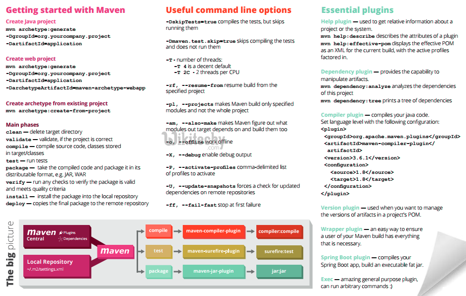

# Maven Demos
> Here goes your awesome project description!
## Table of contents
* [General info](#general-info)
* [Screenshots](#screenshots)
* [Technologies](#technologies)
* [Project architecture](#project-architecture)
* [Directory Structure](#directory-structure)
* [Features](#features)
* [Status](#status)
* [Contact](#contact)

## General info
Maven is a powerful project management tool that is based on POM (project object model). It is used for projects build, dependency and documentation.
## Screenshots

## Technologies
* Maven - version 3.3.9
* JDK8
* spring
* spring boot
## Project architecture
## Directory Structure
## Maven knowledge

## Code Examples
1. *maven_web* - 使用maven骨架构建web项目
2. *maven_java* -使用maven构建java项目
3. *maven_ssm* -使用Maven构建SSM开发框架
4. *maven_muti_modules* -使用maven多模块开发、私有库搭建等
## Features
List of features ready and TODOs for future development
* Awesome feature 1
To-do list:
* Wow improvement to be done 1
## Status
Project is: _in progress_

## Refences&Further Resources
For further reference, please consider the following sections:

* [Official Apache Maven documentation](https://maven.apache.org/guides/index.html)
* [Spring Boot Maven Plugin Reference Guide](https://docs.spring.io/spring-boot/docs/2.2.5.RELEASE/maven-plugin/)
* [Spring Web](https://docs.spring.io/spring-boot/docs/2.2.5.RELEASE/reference/htmlsingle/#boot-features-developing-web-applications)
* [MyBatis Framework](https://mybatis.org/spring-boot-starter/mybatis-spring-boot-autoconfigure/)

The following guides illustrate how to use some features concretely:
* [maven-tutorial](https://www.wikitechy.com/tutorials/maven/maven-tutorial)
* [Building a RESTful Web Service](https://spring.io/guides/gs/rest-service/)
* [Serving Web Content with Spring MVC](https://spring.io/guides/gs/serving-web-content/)
* [Building REST services with Spring](https://spring.io/guides/tutorials/bookmarks/)
* [MyBatis Quick Start](https://github.com/mybatis/spring-boot-starter/wiki/Quick-Start)
* [Accessing data with MySQL](https://spring.io/guides/gs/accessing-data-mysql/)

## Contact
Created by [@JClearLove](https://www.flynerd.pl/) - feel free to contact me!
    